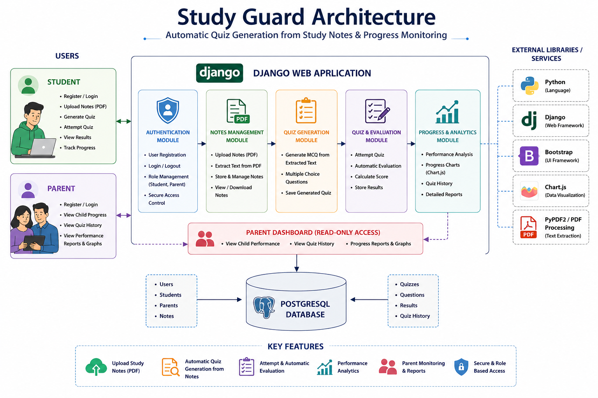
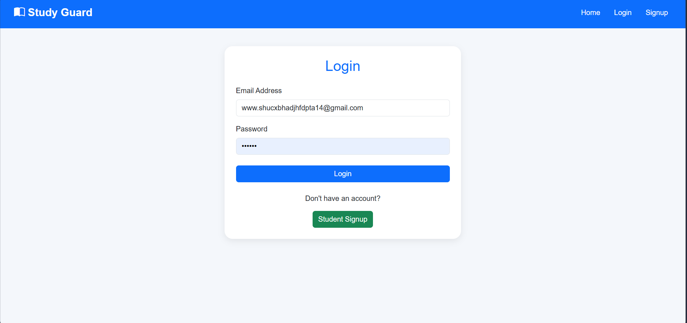
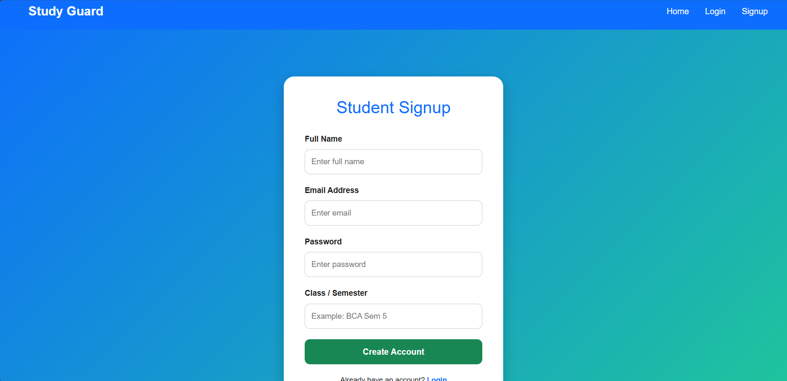
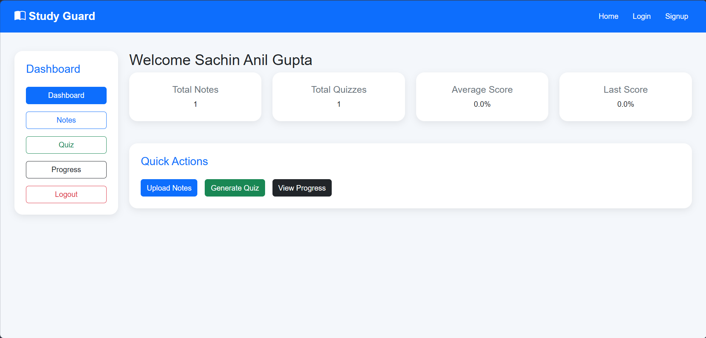
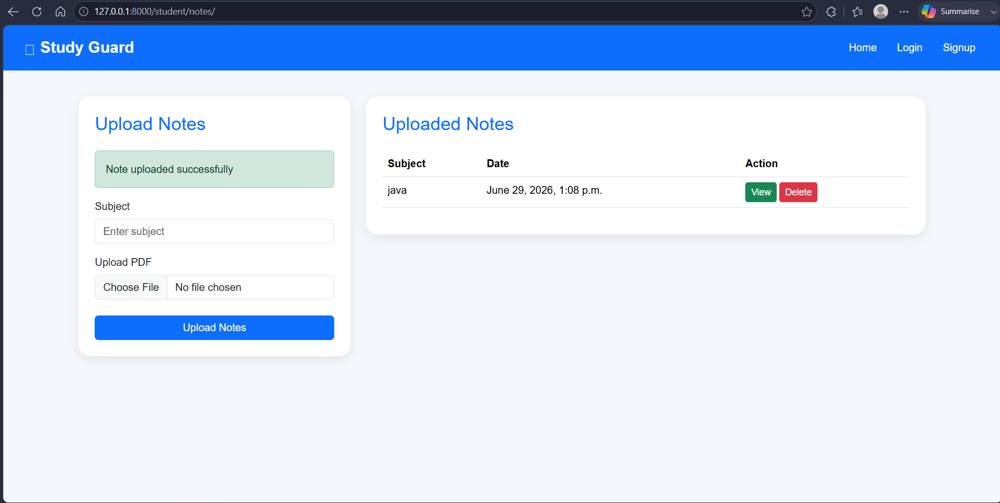
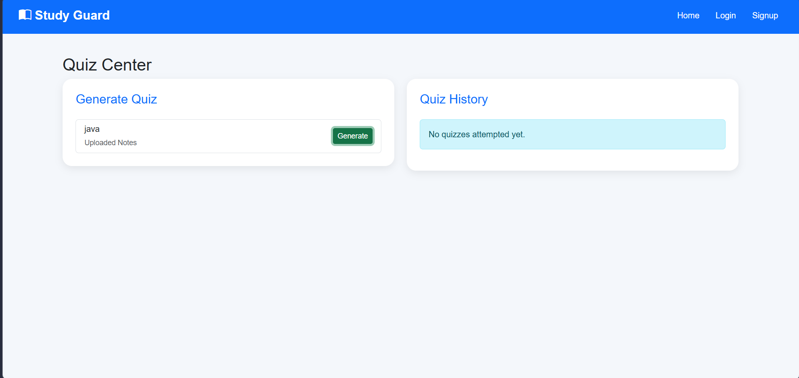
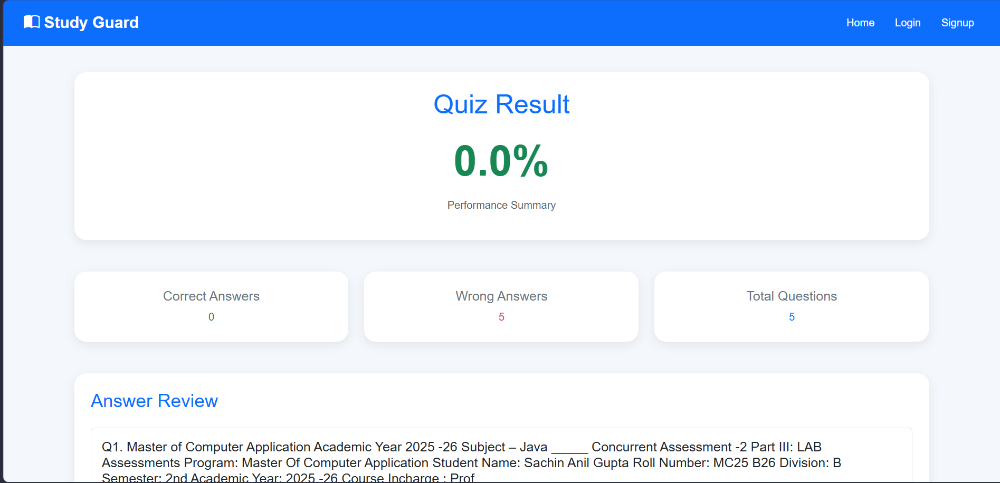
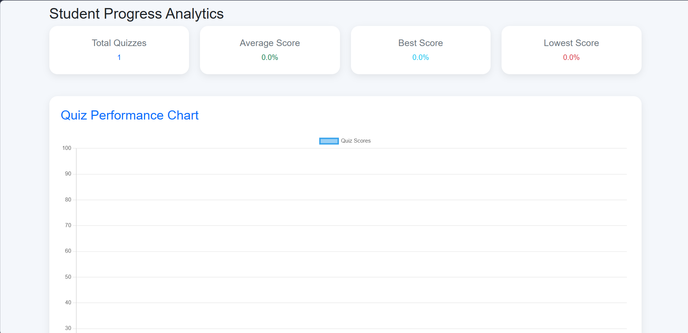
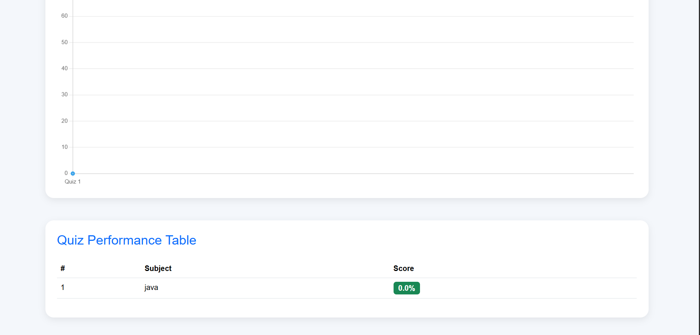

#  Study Guard

### Automated Quiz Generation & Student Progress Monitoring Platform

Study Guard is a web-based educational platform developed using Django that helps students improve their learning experience by automatically generating quizzes from uploaded study notes. The platform evaluates quiz performance, tracks academic progress, and allows parents to monitor their child's learning history through a dedicated dashboard.

The project demonstrates practical implementation of user authentication, PDF-based study material management, automatic quiz generation, result evaluation, progress tracking, and role-based access using Django and PostgreSQL.

---

##  Project Overview

Study Guard simplifies the learning process by allowing students to upload study notes in PDF format. The system extracts the study content and automatically creates multiple-choice quizzes. After completing the quiz, students receive an instant score, while their performance history is stored for future reference.

Parents can securely access their child's progress and quiz history through a dedicated parent dashboard, making it easier to monitor academic performance.

The application was developed to demonstrate full-stack web development using Django while solving a real educational problem.

---

#  Objectives

- Improve student self-learning through automated quizzes.
- Reduce manual quiz preparation.
- Monitor student academic performance.
- Allow parents to track learning progress.
- Demonstrate role-based authentication using Django.
- Showcase practical full-stack web application development.

---

# ✨ Features

-  Secure Student Authentication
-  Parent Login & Progress Monitoring
-  Upload Study Notes (PDF)
-  Automatic Quiz Generation from Uploaded Notes
-  Multiple Choice Quiz System
-  Automatic Quiz Evaluation
-  Student Progress Tracking
-  Quiz History Management
-  Parent Dashboard for Viewing Student Performance
-  PostgreSQL Database Integration
-  Responsive User Interface using Bootstrap
-  Secure User Session Management

---

# 🎓 User Roles

### 👨‍🎓 Student

Students can:

- Register and log in securely
- Upload study notes
- Generate quizzes from uploaded notes
- Attempt quizzes
- View quiz scores
- Track previous quiz attempts
- Download their uploaded notes

---

### 👨‍👩‍👧 Parent

Parents can:

- Log in securely
- View their child's quiz history
- Monitor academic performance
- Track learning progress

---

# ⚙️ Key Functionalities

### 📄 Notes Management

Students upload study material in PDF format. The uploaded notes become the source for automatic quiz generation.

### 📝 Quiz Generation

The system processes the uploaded notes and automatically creates multiple-choice questions based on the extracted study content.

### 📊 Performance Evaluation

After quiz submission, the application automatically evaluates answers, calculates the score, and stores the result in the database.

### 📈 Progress Monitoring

All quiz attempts are stored, allowing students and parents to monitor academic progress over time.

---
# 🏗️ System Architecture

<p align="center">

</p>

The application follows a role-based web architecture where students upload study notes, the system generates quizzes automatically, evaluates quiz performance, stores academic records, and allows parents to monitor student progress.

### Workflow

```
Student
   │
   ▼
Login / Register
   │
   ▼
Upload Study Notes (PDF)
   │
   ▼
Automatic Quiz Generation
   │
   ▼
Attempt Quiz
   │
   ▼
Automatic Evaluation
   │
   ▼
Progress & Quiz History
   │
   ▼
Parent Dashboard
```

---

# 🛠️ Technology Stack

## Backend

| Technology | Purpose |
|------------|---------|
| Python | Programming Language |
| Django | Web Framework |
| Django ORM | Database Operations |
| PostgreSQL | Relational Database |

---

## Frontend

| Technology | Purpose |
|------------|---------|
| HTML5 | Web Pages |
| CSS3 | Styling |
| Bootstrap 5 | Responsive UI |
| JavaScript | Client-side Functionality |

---

## Database

| Technology | Purpose |
|------------|---------|
| PostgreSQL | Store Users, Notes, Quizzes & Results |

---

## Development Tools

| Tool | Purpose |
|------|---------|
| VS Code | Code Editor |
| Git | Version Control |
| GitHub | Repository Hosting |

---

# 📸 Application Screenshots

## 🔐 Login

<p align="center">

</p>

Secure authentication for students and parents.

---

## 📝 Student Registration

<p align="center">

</p>

New students can create an account before accessing the platform.

---

## 🏠 Student Dashboard

<p align="center">

</p>

Students can manage study notes, quizzes, and monitor their learning progress from a centralized dashboard.

---

## 📄 Upload Study Notes

<p align="center">

</p>

Students upload PDF study material that is used for automatic quiz generation.

---

## 📝 Quiz Generation

<p align="center">

</p>

The system automatically generates multiple-choice questions based on the uploaded study notes.

---

## 📊 Quiz Result

<p align="center">

</p>

After quiz submission, the application evaluates answers and displays the student's score instantly.

---

## 👨‍👩‍👧 Parent Dashboard

<p align="center">

</p>

Parents can securely view their child's quiz history and monitor academic performance.

---

## 📈 Progress History

<p align="center">

</p>

Students and parents can review previous quiz attempts and track learning progress over time.

---
# 📂 Project Structure

```
Study-Guard
│
├── assets/
├── architecture/
├── screenshots/
├── accounts/
├── parents/
├── quizzes/
├── students/
├── templates/
├── static/
├── media/
├── smartstudy/
├── manage.py
├── requirements.txt
└── README.md
```

---

# ⚙️ Installation Guide

## 1. Clone the Repository

```bash
git clone https://github.com/Sachingupta209/Study-Guard.git

cd Study-Guard
```

---

## 2. Create a Virtual Environment

### Windows

```bash
python -m venv venv

venv\Scripts\activate
```

### Linux / macOS

```bash
python3 -m venv venv

source venv/bin/activate
```

---

## 3. Install Dependencies

```bash
pip install -r requirements.txt
```

---

## 4. Configure PostgreSQL Database

Update the database configuration inside:

```
settings.py
```

Example:

```python
DATABASES = {
    'default': {
        'ENGINE': 'django.db.backends.postgresql',
        'NAME': 'studyguard',
        'USER': 'postgres',
        'PASSWORD': 'your_password',
        'HOST': 'localhost',
        'PORT': '5432',
    }
}
```

---

## 5. Apply Database Migrations

```bash
python manage.py makemigrations

python manage.py migrate
```

---

## 6. Create an Admin User (Optional)

```bash
python manage.py createsuperuser
```

---

## 7. Run the Development Server

```bash
python manage.py runserver
```

Open your browser:

```
http://127.0.0.1:8000
```

---

# 🔄 Application Workflow

The Study Guard platform follows a simple learning workflow.

### Step 1

Student registers and logs into the system.

↓

### Step 2

Student uploads study notes in PDF format.

↓

### Step 3

The application extracts the study content.

↓

### Step 4

Multiple-choice quiz questions are generated automatically.

↓

### Step 5

Student attempts the quiz.

↓

### Step 6

The system evaluates answers and calculates the score.

↓

### Step 7

Quiz history and performance are stored.

↓

### Step 8

Parents can log in to monitor the student's academic progress.

---

# 🔐 Security Features

- User Authentication
- Role-Based Access Control
- Password Hashing using Django Authentication
- Session Management
- Protected Student & Parent Dashboards
- Secure Database Access
- Form Validation
- CSRF Protection

---

# 📌 Key Modules

### 👤 Authentication Module

Handles secure login and registration for students and parents.

---

### 📄 Notes Management Module

Allows students to upload and manage study notes.

---

### 📝 Quiz Module

Automatically generates multiple-choice quizzes from uploaded study notes.

---

### 📊 Result Module

Evaluates quiz submissions and stores student scores.

---

### 👨‍👩‍👧 Parent Module

Provides parents with access to their child's quiz history and learning progress.

---
# 🚀 Future Enhancements

The following features can be added in future versions of Study Guard:

-  Email notifications for quiz results
-  Mobile responsive improvements
-  Interactive analytics dashboard
-  Support for multiple study material formats (DOCX, PPT, TXT)
-  Advanced search and filtering for notes
-  Teacher Dashboard
-  Custom Quiz Creation
-  Cloud Deployment (AWS / Azure)
-  Export Quiz Reports as PDF
-  Two-Factor Authentication (2FA)
   Performance Visualization using Charts
-  AI-assisted Quiz Generation using Large Language Models (Future Enhancement)

---

# 🌍 Project Status

> ✅ Completed

Study Guard is fully functional and demonstrates:

- Role-based authentication
- Study notes management
- Automatic quiz generation
- Quiz evaluation
- Student progress tracking
- Parent monitoring
- PostgreSQL integration
- Responsive web interface

---

# 💡 Learning Outcomes

This project helped strengthen practical knowledge in:

- Python Programming
- Django Framework
- PostgreSQL Database
- Authentication & Authorization
- CRUD Operations
- File Upload Handling
- Database Design
- Responsive Web Development
- Git & GitHub
- Software Project Structure

---

# 📄 Repository Information

| Item | Details |
|------|---------|
| Project | Study Guard |
| Project Type | Full Stack Web Application |
| Framework | Django |
| Database | PostgreSQL |
| Version Control | Git & GitHub |

---

# 👨‍💻 Author

**Sachin Gupta**

Backend Developer | Java | Python | Cloud & DevOps Enthusiast

### Technologies

- Java
- Spring Boot
- Python
- Django
- PostgreSQL
- React
- Docker
- AWS
- Git
- GitHub

----

# 🤝 Contributing

Contributions are welcome.

If you'd like to improve Study Guard:

1. Fork the repository.
2. Create a feature branch.
3. Commit your changes.
4. Submit a Pull Request.

---


## 📚 Study Guard

### Automated Quiz Generation & Student Progress Monitoring Platform

**Built with Python, Django & PostgreSQL**

</div>
# StudyGrade

