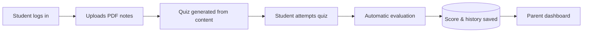

<div align="center">

# 🎓 StudyGrade

### Turn your study notes into quizzes — and let parents follow the progress.


**Upload PDF notes → get an auto-generated quiz → track scores over time → share progress with parents.**

[Features](#-features) · [Screenshots](#-screenshots) · [How it works](#-how-it-works) · [Quick start](#-quick-start) · [Roadmap](#-roadmap)

</div>

---

## 📖 About

**StudyGrade** is a full-stack web app built with **Django** that helps students revise smarter. A student uploads study notes as a PDF, the app generates a multiple-choice quiz from the content, scores the attempt instantly, and saves every result. Parents get their own dashboard to follow their child's quiz history and improvement.

**Why I built it:** manually making practice questions is slow, and parents rarely get a clear view of how a student is actually doing. StudyGrade handles both.

---

## ✨ Features

| | Feature | What it does |
|---|---|---|
| 🔐 | **Role-based login** | Separate student and parent accounts with protected dashboards |
| 📄 | **PDF notes upload** | Students upload study material and manage it from one place |
| 📝 | **Auto quiz generation** | MCQ questions created from the uploaded notes |
| ✅ | **Instant evaluation** | Answers are checked and the score is shown right after submission |
| 📈 | **Progress tracking** | Every attempt is stored, so improvement is visible over time |
| 👨‍👩‍👧 | **Parent dashboard** | Parents can view quiz history and performance |
| 📱 | **Responsive UI** | Works on desktop and mobile screens |

---

## 📸 Screenshots

<table>
  <tr>
    <td align="center"><b>🔐 Login</b><br></td>
    <td align="center"><b>📝 Register</b><br></td>
  </tr>
  <tr>
    <td align="center"><b>🏠 Student Dashboard</b><br></td>
    <td align="center"><b>📄 Upload Notes</b><br></td>
  </tr>
  <tr>
    <td align="center"><b>🧠 Quiz Generator</b><br></td>
    <td align="center"><b>📊 Quiz Result</b><br></td>
  </tr>
  <tr>
    <td align="center"><b>👨‍👩‍👧 Parent Dashboard</b><br></td>
    <td align="center"><b>📈 Progress History</b><br></td>
  </tr>
</table>

---

## 🔄 How it works



<details>
<summary><b>System architecture diagram</b></summary>


</details>

---

## 🧰 Tech stack

| Layer | Technologies |
|---|---|
| **Backend** | Python, Django, Django ORM |
| **Database** | PostgreSQL |
| **Frontend** | HTML5, CSS3, Bootstrap 5, JavaScript |
| **Deployment** | Procfile + `runtime.txt` included (Heroku-style hosting) |
| **Tools** | Git, GitHub, GitHub Actions |

---

## 🚀 Quick start

**1. Clone the repo**

```bash
git clone https://github.com/Sayali283/StudyGrade.git
cd StudyGrade
```

**2. Create a virtual environment**

```bash
# Windows
python -m venv venv
venv\Scripts\activate

# Linux / macOS
python3 -m venv venv
source venv/bin/activate
```

**3. Install dependencies**

```bash
pip install -r requirements.txt
```

**4. Set up environment variables**

```bash
cp .env.example .env
```

Open `.env` and fill in your own values (secret key, database details, etc.). Never commit the real `.env` file.

**5. Run migrations**

```bash
python manage.py migrate
```

**6. (Optional) Create an admin user**

```bash
python manage.py createsuperuser
```

**7. Start the server**

```bash
python manage.py runserver
```

Then open **http://127.0.0.1:8000** in your browser. 🎉

---

## 📁 Project structure

```
StudyGrade/
├── .github/workflows/   # CI workflow
├── assets/              # Architecture diagram & images
├── core/                # Core app logic
├── smartstudy/          # Django project settings & config
├── project_files/       # Supporting project files
├── screenshots/         # README screenshots
├── manage.py
├── requirements.txt
├── Procfile             # Deployment process definition
├── runtime.txt          # Python version for deployment
└── .env.example         # Sample environment variables
```

---

## 🔐 Security

- Password hashing through Django's authentication system
- Role-based access control for student and parent areas
- Session management and CSRF protection
- Secrets kept in environment variables, not in the code

---

## 🗺️ Roadmap

- [ ] Email notifications for quiz results
- [ ] Charts for performance visualization
- [ ] Support for DOCX / PPT / TXT notes
- [ ] Teacher dashboard
- [ ] Custom quiz creation
- [ ] Export quiz reports as PDF
- [ ] AI-assisted question generation using LLMs
- [ ] Two-factor authentication

---

## 💡 What I learned

Django project structure, authentication and authorization, PostgreSQL and the ORM, file upload handling, database design, responsive UI, and using Git/GitHub for a complete project.

---

## 🤝 Contributing

Contributions and ideas are welcome!

1. Fork the repository
2. Create a feature branch (`git checkout -b feature/your-feature`)
3. Commit your changes
4. Open a Pull Request

---

## 👩‍💻 Author

**Sayali Ingole**
BCA graduate · Python · AI/ML · Full-stack development

[](https://github.com/Sayali283)
[](https://www.linkedin.com/in/sayali-ingole-bb0ab3295)

---

<div align="center">

⭐ If you found this project useful, consider giving it a star!

</div>
